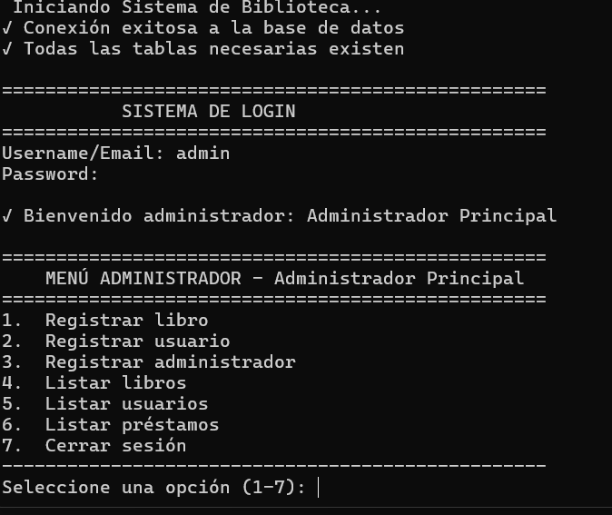

#  Sistema de Biblioteca (Versión Mejorada)

Este proyecto implementa un **Sistema de Biblioteca** en Python conectado a **MySQL**, permitiendo la gestión completa de libros, usuarios, administradores y préstamos.  
La versión actual incluye múltiples mejoras enfocadas en seguridad, estructura, validaciones y experiencia de usuario.

---

##  Descripción general

El sistema permite:
- Registrar libros, usuarios y administradores.
- Iniciar sesión con roles diferenciados (usuario / administrador).
- Registrar y devolver préstamos de libros.
- Controlar disponibilidad y cantidad de ejemplares.
- Consultar listados claros y estructurados desde la consola.

El programa utiliza **Programación Orientada a Objetos (POO)**, maneja errores de conexión, validaciones de entrada, y aplica buenas prácticas de seguridad (hashing de contraseñas, consultas parametrizadas, y validación de datos).

---

##  Estructura del sistema

- **SistemaLibreria (clase principal):** Controla la lógica general y los menús.
- **MySQL Connector:** Permite la conexión con la base de datos.
- **Administradores / Usuarios:** Se gestionan en tablas separadas con contraseñas encriptadas.
- **Libros:** Se registran con detalles completos (ISBN, editorial, categoría, cantidad).
- **Préstamos:** Controlan las fechas y disponibilidad de los libros.
- **Validaciones:** Garantizan datos correctos y evitan errores de tipo o formato.

---

##  Base de datos

El sistema requiere una base de datos llamada **biblioteca** con las tablas:
- `administradores`
- `usuarios`
- `libros`
- `prestamos`

Cada tabla se verifica y crea automáticamente si no existe.

---

##  Mejoras implementadas respecto al código anterior

| Nº | Categoría | Descripción de la mejora |
|----|------------|--------------------------|
| 1 | **Seguridad** | Hash SHA-256 para contraseñas y uso de consultas parametrizadas (%s). |
| 2 | **Base de datos** | Nuevas tablas separadas para administradores y usuarios. Verificación automática al iniciar. |
| 3 | **Gestión de usuarios** | Validación de duplicados, contraseñas seguras y registro más completo (email, dirección, teléfono). |
| 4 | **Gestión de préstamos** | Control de cantidad disponible, estado activo/devuelto y devolución automatizada. |
| 5 | **Gestión de libros** | Nuevos campos (ISBN, editorial, categoría, año, cantidad). Listados más legibles. |
| 6 | **Roles** | Separación entre menús de usuario y administrador con permisos específicos. |
| 7 | **Validaciones** | Nuevas funciones para validar texto, números y correos electrónicos. |
| 8 | **Interfaz** | Menús más limpios, mensajes claros e iconos visuales para estados del sistema. |
| 9 | **Conectividad** | Conexión robusta a MySQL con manejo de errores y cierre automático. |
| 10 | **Mantenibilidad** | Estructura completamente orientada a objetos, lista para ampliarse fácilmente. |

---
## Imagen



---
##  Tecnologías utilizadas

- **Python 3.x**
- **MySQL Connector (mysql-connector-python)**
- **MySQL Server**
- **Hashlib (para seguridad)**

---

##  Ejecución del sistema

1. Asegúrate de tener MySQL configurado y la base de datos `biblioteca` creada.
2. Ejecuta el script principal con:

```bash
python biblioteca.py
```

3. Inicia sesión como **administrador** o **usuario** según tu tipo de cuenta.
4. Usa el menú para registrar, listar o devolver libros.

---

##  Seguridad y buenas prácticas

- Contraseñas nunca se almacenan en texto plano.
- Los datos se validan antes de insertarse en la base.
- Se utilizan *queries* parametrizadas para evitar inyección SQL.
- La interfaz guía al usuario en cada paso con mensajes claros.

---


